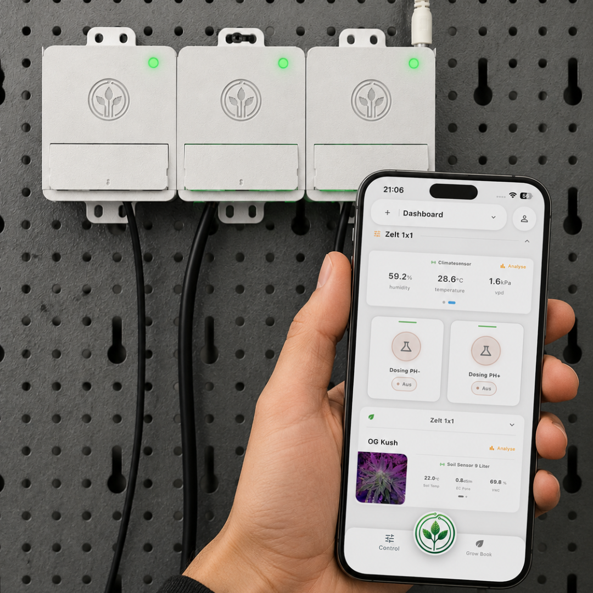
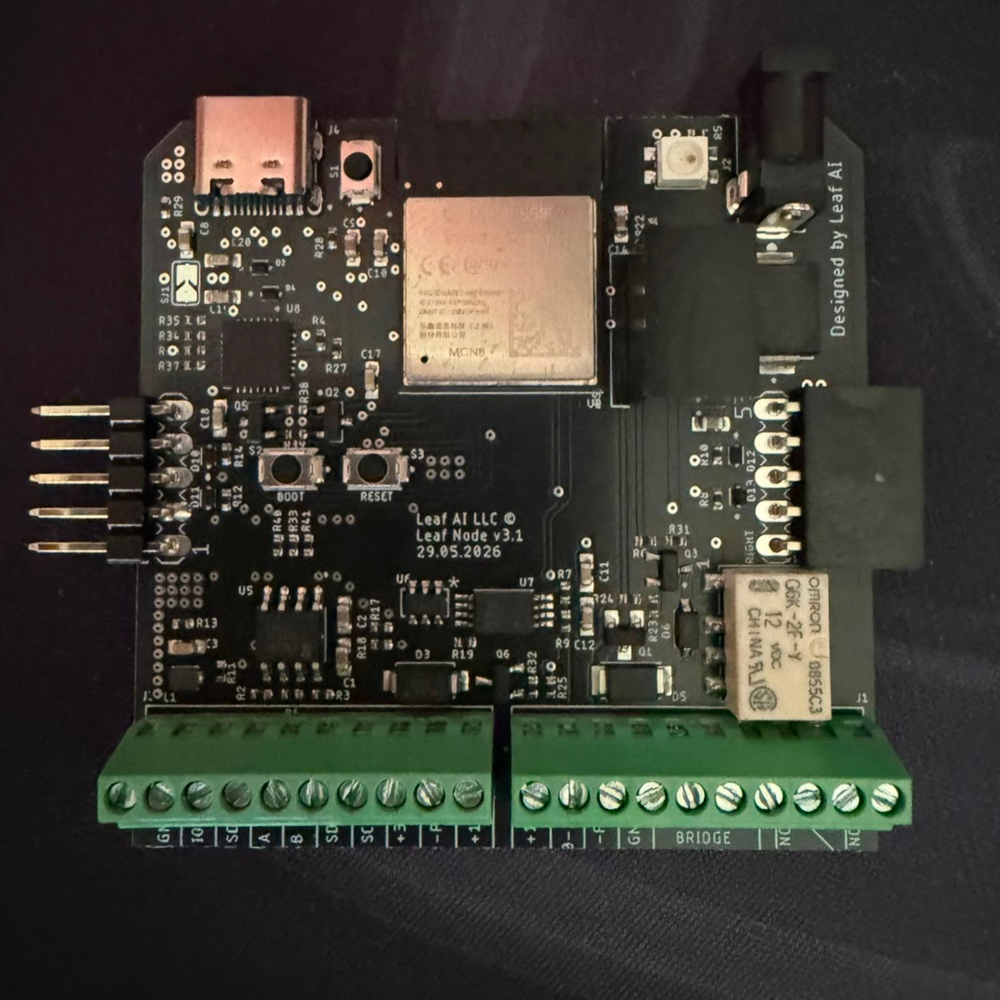
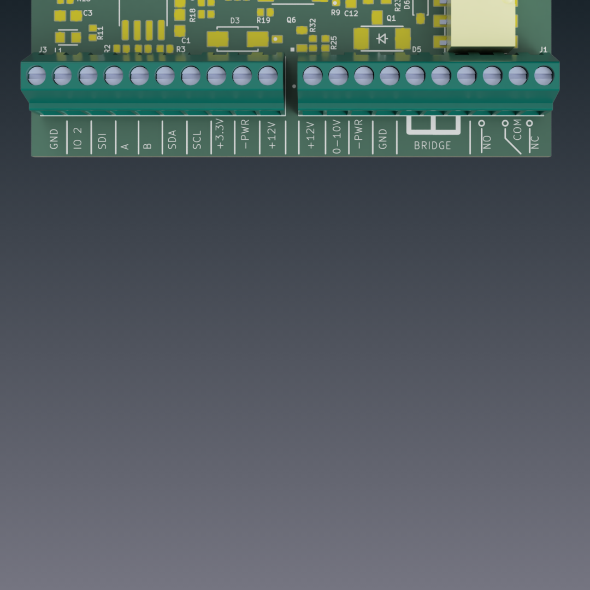
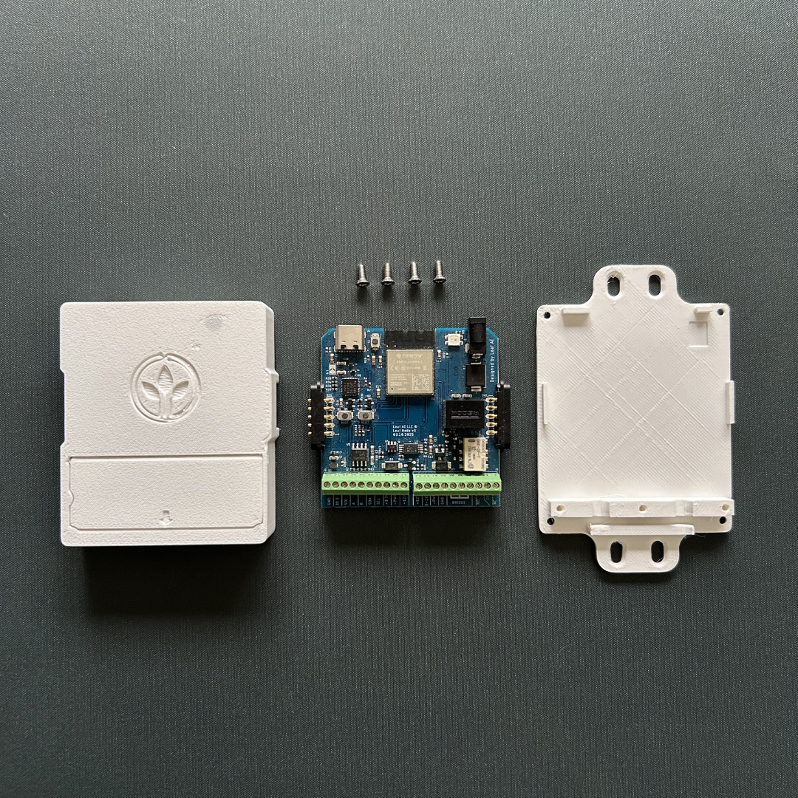

# Leaf Node

The Leaf Node is an open-source environmental 
monitoring and control device built on the 
ESP32-S3. It reads sensor data, publishes it 
over MQTT, and can trigger actuators — allowing 
you to monitor conditions and directly control 
connected devices such as lights, fans, pumps 
and valves. Configuration is handled wirelessly 
via BLE, making it a self-contained building 
block for precision agriculture and 
environmental monitoring and automation systems.



<!-- Hero image: replace the path below with your device photo -->
<!--  -->

---

## Philosophy

Leaf Node is built around one principle: **it should just work.** From first flash to live sensor data in minutes — simple enough for a grower to deploy in the field, open enough for a developer to extend and build on. No unnecessary complexity, no steep learning curve.

---

## Features

- **Multi-protocol sensor support** — I2C, RS485, SDI-12, OneWire on a single board
- **MQTT telemetry** — publishes sensor data and heartbeats, receives commands
- **OTA firmware updates** — triggered via MQTT command, no physical access needed
- **BLE provisioning** — initial Wi-Fi and MQTT setup from the companion app, no serial cable required
- **Scheduling** — DAC and actuator outputs can be programmed on a time-based schedule
- **Smart control** — MOSFET and relay outputs with duration-based switching
- **Node chaining** — UART-based daisy-chain for multi-node deployments
- **Watchdog & health monitoring** — automatic recovery with exponential backoff on sensor errors
- **Factory mode** — serial-console provisioning for production flashing

---

## Hardware



### Overview

| Component | Details |
|-----------|---------|
| MCU | ESP32-S3 |
| Status LED | WS2812B addressable RGB (v3) |
| RS485 | Half-duplex, DE/RE controlled |
| I2C | SDA GPIO8, SCL GPIO9 |
| SDI-12 | GPIO12 (shared with OneWire via hardware bridge) |
| OneWire | GPIO12 |
| Actuators | MOSFET (GPIO36), Relay (GPIO38), DAC (MCP4725 via I2C) |
| PWM | GPIO2 (1 kHz, 10-bit) + MOSFET gate (5 kHz, 10-bit) |



### Supported Sensors

| Sensor | Interface | Wiring | Measurement |
|--------|-----------|--------|-------------|
| SHT31  | I2C (0x44) | +3.3V · GND · SDA · SCL | Temperature, Humidity |
| EZO pH | I2C (0x63) | +3.3V · GND · SDA · SCL | pH |
| EZO EC | I2C (0x64) | +3.3V · GND · SDA · SCL | Electrical Conductivity |
| TEROS 12 | SDI-12 | +3.3V · GND · SDI-12 | Soil moisture, temperature, EC |
| DS18B20 | OneWire | +3.3V · GND · Need Modification | Temperature |
| SLT5007 | RS485 | +3.3V · GND · A · B | VWC, Bulk EC, Soil temperature, Pore EC |
| CWT-PSS | RS485 | +12V · GND · A · B | PAR (Photosynthetically Active Radiation) |
| LEAFTHSN | RS485 | +12V · GND · A · B | Leaf wetness, Leaf temperature |
| CWT-SoilTHS | RS485 | +12V · GND · A · B | VWC, Soil temperature |
| CWT-THXXS | RS485 | +12V · GND · A · B | Air temperature, Humidity, VPD |

### Actuators

| Actuator | GPIO / Interface | Wiring | Typical Use |
|----------|-----------------|--------|-------------|
| MOSFET | GPIO36 | +12V · -PWR | Pumps, fans, DC loads |
| Relay | GPIO38 | COM · NO · NC | AC/DC switching, high-current loads |
| DAC (MCP4725) | I2C (0x60) | 0-10V · GND | Analog 0–5 V output (e.g. dosing pumps) |
| PWM | GPIO2 | IO2 · GND | Variable speed / dimming control |

### PCB & Enclosure



- KiCad project: [hardware/pcb/kiCad/](hardware/pcb/kiCad/)
- Enclosure STL/STEP files: [hardware/enclosure/](hardware/enclosure/)
---

## Getting Started

### Option A — Web Flasher (recommended)

No toolchain required. Works directly in Chrome/Edge.

1. **Get the hardware** — order a ready-to-use Leaf Node at [Build Your Leaf Node](https://leafai.io/build-node.html), or fabricate your own PCB from the [KiCad files](hardware/pcb/kiCad/)
2. Open the **[Leaf AI Firmware Flasher](https://leafai.io/firmware-flasher.html)** and follow the on-screen steps
3. Open the Leaf AI app, tap **Add Device**, and provision Wi-Fi via BLE

That's it — the node connects to the Leaf AI backend and starts publishing sensor data.

> A free Leaf AI account is required to use the app. Sign up directly in the Leaf AI app.

---

### Option B — Build from source (PlatformIO)

For developers who want to modify or extend the firmware.

**Prerequisites:** [PlatformIO](https://platformio.org/) (CLI or VS Code extension)

#### 1. Assemble the hardware

Fabricate the PCB from the files in [hardware/pcb/](hardware/pcb/) and wire your sensors according to the pin table above.

#### 2. Flash the firmware

> **First flash:** Use the **[Leaf AI Firmware Flasher](https://leafai.io/firmware-flasher.html)** for the initial flash. It writes a compatible serial number to the device that is required for communication with the Leaf AI app. Subsequent builds can be uploaded via PlatformIO.

```bash
git clone https://github.com/leafai-io/leaf-node-v3.1.git
cd leaf-node-v3.1
pio run --target upload
```

Monitor serial output (115200 baud):

```bash
pio device monitor
```

#### 3. Provision via BLE

Open the Leaf AI app, tap **Add Device**, and follow the on-screen steps to configure Wi-Fi and link your account.

---

## Using with the App


Once your Leaf Node is provisioned, open the Leaf AI app to view live sensor readings, configure schedules, and control actuators — all from your phone.

---

## License

This project uses two open-source licences depending on what you are working with:

| Component | Licence |
|-----------|---------|
| Firmware / Software | [GNU AGPL-3.0](licenses/LICENSE-SOFTWARE) |
| Hardware (PCB, enclosure) | [CERN-OHL-S v2](licenses/LICENSE-HARDWARE) |

**Software (AGPL-3.0):** You can use, modify, and distribute the firmware freely, but any modified version you run as a networked service must also be released under the same licence.

**Hardware (CERN-OHL-S v2):** You can study, modify, and manufacture the hardware freely, but any modified design you distribute or produce must be released under the same licence with complete source files.

**If you create a fork, we'd love to hear about it.** Open an issue or send us a message so we can showcase your project and potentially integrate useful improvements.

---

## Support

Leaf AI is an independent, open-source project. If you find it useful, you can support its continued development at [Leaf AI Support](https://leafai.io/support.html).
